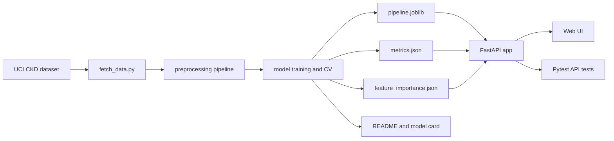

# Codex CLI Prompt Design and Related CKD Project Topics Based on Smart-Kidney-Sense

## Executive summary

The reference repository, `Sulthonikamalm/Smart-Kidney-Sense`, is a Telkom University “Tugas Besar Sistem Cerdas” project for early Chronic Kidney Disease screening. It presents itself as an AI-based CKD risk detector built from 24 clinical parameters, an optimized Decision Tree model, Python/scikit-learn/Pandas/NumPy on the backend, static HTML/CSS/JavaScript on the frontend, and Vercel-style serverless routing. The project structure centers on `api/predict.py`, stored `model.joblib` and `scaler.joblib`, static pages in `public/`, a minimal health endpoint, and a local runner script. citeturn2view0turn3view0turn8view0turn9view0turn4view1turn4view2

The safest way to build a closely related academic project without drifting into imitation is to keep the same problem family—CKD screening on the UCI CKD dataset—but change the research question, model-evaluation protocol, API contract, naming, and UI architecture. In practice, the strongest differentiators are these: compare multiple models instead of using one deployed tree, switch to a single scikit-learn `Pipeline` artifact rather than separate model and scaler files, use English UCI-grounded field names and semantic categorical values instead of the repo’s Indonesian numeric field schema, and build a visibly different interface instead of the repo’s four-step wizard with demo autofill and glassmorphism styling. citeturn6view0turn11view4turn13view0turn13view1turn13view3turn22view3turn16view0

For Codex CLI specifically, the official guidance is very clear: robust prompts work best when they explicitly define the **Goal**, **Context**, **Constraints**, and **Done when** criteria. Durable repo-specific rules should go into `AGENTS.md`, and non-interactive runs should use `codex exec`, which supports setting the workspace root with `-C` and reading the prompt from standard input with `-`. citeturn26view2turn26view4turn17view4turn18view0

My strongest recommendation for your case is a project in the “same domain, different contribution” lane: **an explainable CKD screening web app with model comparison and reproducibility controls**. That gives you a project close enough to the reference repo to be relevant, but different enough in methodology, API design, and output artifacts to stand on its own. The UCI CKD dataset is well suited for this because it is explicitly a classification dataset with 400 instances, 24 features, missing values, and class labels `ckd` / `notckd`, and it includes a formal citation and CC BY 4.0 license that you can reuse with attribution. citeturn16view0

## What the reference repo actually does

At the repository level, the source project is a small full-stack ML web app. The README identifies it as a CKD early detection system, states that it uses 24 clinical parameters and an optimized Decision Tree, and lists Python, scikit-learn, Pandas, NumPy, HTML5, CSS3, JavaScript, and Vercel deployment. The top-level tree includes `api/`, `public/`, `requirements.txt`, `run_local.py`, and `vercel.json`; inside `api/` are `predict.py`, `health.py`, `requirements.txt`, and `models/` containing `model.joblib` and `scaler.joblib`. The root requirements pin `scikit-learn==1.4.2` and include Pandas, Joblib, and NumPy. citeturn2view0turn3view0turn8view0turn7view1turn4view0

The backend is intentionally simple. `api/predict.py` subclasses `BaseHTTPRequestHandler`, reads JSON from a POST body, loads `model.joblib` and `scaler.joblib`, constructs a Pandas dataframe with 24 expected features, scales the dataframe, predicts with the loaded model, and returns a JSON response in the form `{"prediction": "<value>"}`. `api/health.py` returns `{"status":"ok"}` on GET. This means the current repo’s contract is lightweight and easy to understand, but it is also a good place to introduce a visible differentiator in a new project: typed validation, semantic labels, model metadata, and richer error handling. citeturn6view0turn7view0

The frontend organizes the same 24 inputs into four groups: profile/vitals, urinalysis, hematology/biochemistry, and medical history. The JavaScript dynamically renders fields, includes a “demo data” autofill function, posts the form to `/api/predict`, and shows a result modal. The modal logic maps prediction `0` to a CKD-risk message and the other branch to a low-risk message. This is important for your prompt design: if you want uniqueness, explicitly tell Codex **not** to reproduce a four-step wizard, a demo-fill button, or a modal that simply maps numeric predictions into fixed copy. citeturn11view4turn13view0turn13view1turn13view3turn27view0

The most relevant external primary source is the UCI Chronic Kidney Disease dataset that the repo’s schema strongly aligns with. UCI documents the CKD dataset as a multivariate classification problem with 400 instances, 24 features, missing values, and class labels `ckd` and `notckd`. It also lists the exact variable names and allowed categorical values—such as `rbc` = `normal` / `abnormal`, `pcc` = `present` / `notpresent`, and `htn`, `dm`, `cad`, `pe`, `ane` = `yes` / `no`—which gives you an excellent basis for an English, semantically meaningful API schema rather than numeric-only inputs. UCI also provides a DOI citation and states that the dataset is released under CC BY 4.0, which means you should cite it in your README and report. citeturn16view0

A clean architecture pattern for a new project—close to the reference repo, but clearly distinct—looks like this. The key differences are a single `Pipeline` artifact, stronger evaluation, and explainability outputs. These improvements are consistent with scikit-learn’s documented use of pipelines, cross-validation, controlled `random_state`, and model inspection tools. citeturn22view3turn22view4turn17view0turn17view2turn23view0



## Codex CLI prompt design principles

The most dependable Codex prompts for this assignment should be treated like mini-specifications, not casual one-liners. OpenAI’s own Codex guidance says the best default prompt structure is to specify the **Goal**, **Context**, **Constraints**, and **Done when** criteria. That matters especially here because your task is partly generative and partly anti-copying: you want Codex to produce a related project while avoiding the names, README phrasing, UI pattern, and branding of the original repository. citeturn26view2turn17view3

Because Codex CLI is designed to read, change, and run code in the current directory, the prompt should not rely on a repository URL alone. The official docs describe Codex CLI as a local coding agent, and the best-practices guide emphasizes that the biggest quality gain comes from putting the crucial project context directly into the prompt or into `AGENTS.md`. That is why the prompt templates below name the reference repo URL **and** restate the important cues from it: 24-feature CKD screening, simple `/predict` API, stored model artifacts, and a static web interface. citeturn14search0turn26view2turn26view4

For repeated work, move the stable rules out of the prompt and into `AGENTS.md`. The official Codex docs say `AGENTS.md` is automatically read before work starts, can be layered globally and per-repo, and should include repo layout, run/test commands, conventions, constraints, and what “done” means. The CLI even provides `/init` to scaffold a starter `AGENTS.md`. In your case, the permanent rules are straightforward: cite the UCI dataset, do not copy names/README/UI from the reference repo, keep medical language limited to screening/risk rather than diagnosis, and always create or update tests. citeturn17view4turn26view4

For execution, the most useful commands are the documented non-interactive path and its resume flow. `codex exec` is the stable command for scripted runs, `-C` changes the workspace root, prompts can be piped in through stdin using `-`, and `codex exec resume --last` continues the most recent session. The official prompting docs also warn against having multiple threads modify the same files in parallel, so for a project build like this, reusing the same session is safer than starting several competing sessions against one codebase. citeturn18view0turn17view5

Methodologically, your prompt should instruct Codex to build the ML side in a reproducible and reviewable way. Scikit-learn’s documentation notes that evaluating on the same data used for fitting is a methodological mistake, recommends held-out evaluation and cross-validation, and documents that an integer `random_state` makes repeated `fit` and `split` calls reproducible. A `Pipeline` is especially useful here because it lets preprocessing and prediction be fit and cross-validated together, which is a clean upgrade over the reference repo’s separate `scaler.joblib` and `model.joblib` artifacts. citeturn22view4turn17view0turn17view1turn22view3turn6view0

For explainability, the safest built-in path is to ask for tree-model `feature_importances_` where available and permutation importance for a model-agnostic explanation layer. Scikit-learn documents both approaches, while SHAP and LIME are reasonable optional additions if you want richer local explanations and are willing to add dependencies. In the prompt, make SHAP/LIME optional rather than mandatory so the project can still build cleanly without them. citeturn23view0turn17view2turn20search0turn20search4

For the API layer, I recommend Python plus FastAPI instead of reproducing the bare `BaseHTTPRequestHandler` approach from the reference repo. FastAPI is officially documented as a modern API framework built on standard Python type hints and automatic documentation, and its request-body model pattern is particularly useful here because you can validate CKD screening payloads with explicit field types and semantic enums. That, in turn, supports better tests and a clearer API contract. citeturn22view0turn24search1turn28search1

A recommended **canonical request schema** for a new project is shown below. It is based on the UCI variable definitions, but it deliberately uses English field names and semantic categorical values to differentiate your work from the reference repo’s Indonesian numeric form contract. citeturn16view0turn6view0

```json
{
  "age": 55,
  "blood_pressure": 80,
  "specific_gravity": 1.02,
  "albumin": 0,
  "sugar": 0,
  "red_blood_cells": "normal",
  "pus_cell": "normal",
  "pus_cell_clumps": "notpresent",
  "bacteria": "notpresent",
  "blood_glucose_random": 120,
  "blood_urea": 40,
  "serum_creatinine": 1.2,
  "sodium": 137,
  "potassium": 4.5,
  "hemoglobin": 14.5,
  "packed_cell_volume": 45,
  "white_blood_cell_count": 8000,
  "red_blood_cell_count": 5.2,
  "hypertension": "no",
  "diabetes_mellitus": "no",
  "coronary_artery_disease": "no",
  "appetite": "good",
  "pedal_edema": "no",
  "anemia": "no"
}
```

```json
{
  "prediction": "notckd",
  "probability": 0.85,
  "top_features": [
    {"feature": "serum_creatinine", "importance": 0.21},
    {"feature": "hemoglobin", "importance": 0.16},
    {"feature": "albumin", "importance": 0.12}
  ],
  "model_name": "random_forest",
  "dataset_source": "UCI CKD"
}
```

## Topic options and concise Codex templates

The five topic options below all stay in the same scientific/problem domain as the reference repo, but each changes the project contribution enough to make a cleaner academic case. The table focuses on novelty, dataset grounding, algorithms, and visible deliverables. The evaluation ideas—cross-validation, classification reports, confusion matrices, ROC AUC where probabilities are available, and feature-importance-style inspection—come directly from official scikit-learn documentation. citeturn22view4turn21search1turn21search2turn20search2turn17view2turn23view0

| Title | Novelty and differentiator | Datasets | Key algorithms | Main deliverables |
|---|---|---|---|---|
| Comparative CKD Classifier Benchmark | Reframes the work from a single deployed detector into a comparative study of which classifier generalizes best on CKD screening, rather than the example repo’s single optimized Decision Tree. citeturn2view0turn22view4 | UCI CKD dataset with 400 instances, 24 features, missing values, and `ckd` / `notckd` labels. citeturn16view0 | Logistic Regression, Decision Tree, Random Forest, SVM, k-NN | model leaderboard, metrics report, prediction API, simple web dashboard |
| Explainable CKD Screening Assistant | Keeps the same problem domain but adds a clear explanation layer through feature importance and optional SHAP/LIME instead of a raw numeric result. citeturn23view0turn17view2turn20search0turn20search4 | UCI CKD. citeturn16view0 | Random Forest or Gradient-style tree baseline, plus optional SHAP/LIME | API with prediction and explanation, explainer JSON, explanation UI |
| Missing-Data-Resilient CKD Predictor | Focuses on robustness under missing values, which is especially relevant because UCI documents that the dataset has missing values. citeturn16view0 | UCI CKD. citeturn16view0 | Imputation pipelines + Random Forest / Logistic Regression / SVM | imputation benchmark report, training script, API, web form with missing-field handling |
| Calibrated CKD Risk Scorer | Shifts the emphasis from hard classification toward probability quality, threshold tuning, and risk communication. | UCI CKD. citeturn16view0 | Logistic Regression, Random Forest, SVM with probabilities where supported | probability API, threshold controls, metrics/threshold report, risk-oriented UI |
| Reproducible CKD Mini-MLOps Project | Focuses on end-to-end reproducibility with fetch scripts, pinned dependencies, artifact metadata, health endpoints, and tests—more engineering rigor than the example repo’s lightweight app structure. citeturn3view0turn4view0turn7view0 | UCI CKD with stored citation/metadata. citeturn16view0 | Pipeline-based best-model selection | fetch/train/serve/test workflow, API, web UI, README, model card |

All of the prompt templates below are designed to be saved into a file and run with a documented non-interactive Codex CLI flow such as `codex exec -C . - < prompt.txt`, then continued with `codex exec resume --last "Run tests, fix failures, and polish the README."` if needed. That pattern matches the official CLI reference. citeturn18view0

```bash
cat > prompt.txt <<'EOF'
[paste one template below]
EOF

codex exec -C . - < prompt.txt
```

**Topic option: Comparative CKD Classifier Benchmark**

```text
You are Codex working in the current repository.

Goal
Build a new CKD screening project inspired by https://github.com/Sulthonikamalm/Smart-Kidney-Sense but do not copy its name, README wording, UI layout, Indonesian field names, four-step wizard, demo-fill button, result modal text, or branding.

Context
- Problem domain: CKD risk classification from the UCI Chronic Kidney Disease dataset.
- Keep the project academically original by changing the contribution from “single deployed detector” to “multi-model comparison and benchmarking”.
- Prefer Python + scikit-learn + FastAPI + simple static web UI.

Expected inputs and outputs
- Training input: UCI CKD dataset with the full 24-feature schema.
- API input: English JSON field names and semantic categorical values.
- API output: semantic label (ckd/notckd), probability, chosen model name, and metrics summary.
- Training output: best model artifact, metrics.json, leaderboard.json.

Generate this structure
- scripts/fetch_data.py
- src/train_compare.py
- src/preprocess.py
- app/main.py
- app/schemas.py
- app/artifacts/
- web/index.html
- web/app.js
- web/styles.css
- tests/test_api.py
- tests/test_training.py
- README.md
- requirements.txt

Required dependencies
fastapi, uvicorn, scikit-learn, pandas, numpy, joblib, ucimlrepo, pytest

Sample commands to support
- python scripts/fetch_data.py
- python -m src.train_compare --random-state 42
- uvicorn app.main:app --reload --port 8000
- pytest -q

Sample API payload
Use the 24 UCI CKD features with English keys such as:
age, blood_pressure, specific_gravity, albumin, sugar, red_blood_cells, pus_cell, pus_cell_clumps, bacteria, blood_glucose_random, blood_urea, serum_creatinine, sodium, potassium, hemoglobin, packed_cell_volume, white_blood_cell_count, red_blood_cell_count, hypertension, diabetes_mellitus, coronary_artery_disease, appetite, pedal_edema, anemia.

Tests
- GET /api/v1/health returns 200 and {"status":"ok"}.
- POST /api/v1/screen with a valid payload returns 200 and keys: prediction, probability, model_name.
- Training command writes artifacts and a leaderboard.

Done when
- The app runs locally.
- The best model is selected by cross-validation.
- Tests pass.
- README cites the UCI CKD dataset and states this is an educational screening project, not a diagnosis tool.
```

**Topic option: Explainable CKD Screening Assistant**

```text
You are Codex working in the current repository.

Goal
Create a new CKD web app inspired by https://github.com/Sulthonikamalm/Smart-Kidney-Sense, but make the core contribution explainability. Do not copy names, README sections, UI patterns, or route design from the example repo.

Context
- Use the UCI CKD dataset.
- Build a prediction API plus an explanation API.
- Prefer Random Forest or another interpretable tree baseline, with permutation importance always included and SHAP optional if dependency install succeeds cleanly.

Expected inputs and outputs
- Input: full 24-feature CKD payload using English field names.
- Output: prediction label, probability, and top contributing features.

Generate or modify
- scripts/fetch_data.py
- src/train_explainable.py
- src/explain.py
- app/main.py
- app/schemas.py
- app/artifacts/pipeline.joblib
- app/artifacts/metrics.json
- app/artifacts/feature_importance.json
- web/index.html
- web/app.js
- tests/test_api.py
- README.md

Required dependencies
fastapi, uvicorn, scikit-learn, pandas, numpy, joblib, ucimlrepo, pytest
Optional: shap, lime

Sample commands
- python scripts/fetch_data.py
- python -m src.train_explainable --random-state 42
- uvicorn app.main:app --reload
- pytest -q

Sample API payload
Provide one valid example payload in README and API docs using semantic values like "normal", "abnormal", "yes", "no", "good", "poor", "present", "notpresent".

Tests
- /api/v1/health returns {"status":"ok"}.
- /api/v1/screen returns 200 and includes top_features.
- invalid request body returns a validation error.
- artifact files exist after training.

Done when
- The web UI shows both prediction and explanation.
- The README explains that explanations are model behavior summaries, not causal medical findings.
```

**Topic option: Missing-Data-Resilient CKD Predictor**

```text
You are Codex working in the current repository.

Goal
Build a CKD prediction project inspired by https://github.com/Sulthonikamalm/Smart-Kidney-Sense, but centered on handling missing values robustly. Do not copy the example repo’s branding, UI, README, or Indonesian-only schema.

Context
- UCI CKD explicitly contains missing values.
- Compare at least two preprocessing strategies for missing data.
- Keep the app deployment simple: FastAPI backend plus static frontend.

Expected inputs and outputs
- Input: 24-feature payload; allow some fields to be omitted in the UI and warn the user clearly.
- Output: prediction, probability, note about imputed fields, and a preprocessing summary.

Generate this structure
- scripts/fetch_data.py
- src/train_missingness.py
- src/preprocess.py
- app/main.py
- app/schemas.py
- web/index.html
- web/app.js
- tests/test_api.py
- tests/test_preprocess.py
- reports/missingness_report.md
- README.md

Required dependencies
fastapi, uvicorn, scikit-learn, pandas, numpy, joblib, ucimlrepo, pytest

Sample commands
- python scripts/fetch_data.py
- python -m src.train_missingness --random-state 42
- uvicorn app.main:app --reload
- pytest -q

Sample API payload
Include one full payload and one partially missing payload in README examples.

Tests
- preprocessing removes nulls before model fit.
- valid full payload returns 200.
- partially missing payload returns either a handled prediction path or a clear validation message, according to the implemented design.
- health endpoint works.

Done when
- The repository includes a written comparison of missing-data strategies and the chosen approach.
```

**Topic option: Calibrated CKD Risk Scorer**

```text
You are Codex working in the current repository.

Goal
Create a new CKD probability-focused project inspired by https://github.com/Sulthonikamalm/Smart-Kidney-Sense, but do not copy names, README text, UI structure, colors, or endpoint contract.

Context
- Use the UCI CKD dataset.
- Focus on probability output, threshold tuning, and communicating risk carefully.
- Prefer models that support probability outputs or can be configured to provide them.

Expected inputs and outputs
- Input: 24-feature English API schema.
- Output: prediction label, probability score, threshold used, and recommendation text framed as screening guidance only.

Generate or modify
- scripts/fetch_data.py
- src/train_calibrated.py
- app/main.py
- app/schemas.py
- app/artifacts/
- web/index.html
- web/app.js
- web/styles.css
- tests/test_api.py
- README.md

Required dependencies
fastapi, uvicorn, scikit-learn, pandas, numpy, joblib, ucimlrepo, pytest

Sample commands
- python scripts/fetch_data.py
- python -m src.train_calibrated --random-state 42
- uvicorn app.main:app --reload
- pytest -q

Sample API payload
Document a complete JSON request example and a response example showing prediction + probability + threshold.

Tests
- health endpoint returns 200.
- prediction endpoint returns probability between 0 and 1.
- invalid payload returns a validation error.
- training step writes metrics including confusion matrix and probability-based metric(s).

Done when
- The UI lets the user see probability and threshold rather than only a hard label.
```

**Topic option: Reproducible CKD Mini-MLOps Project**

```text
You are Codex working in the current repository.

Goal
Build a reproducible CKD ML web project inspired by https://github.com/Sulthonikamalm/Smart-Kidney-Sense, but do not copy its branding, README text, frontend flow, or implementation style.

Context
- Use the same public UCI CKD problem family, but upgrade the engineering rigor.
- Use a single serialized scikit-learn Pipeline artifact instead of separate model/scaler files.
- Include artifact metadata, test coverage, and a model card.

Expected inputs and outputs
- Input: training from UCI CKD and prediction from a 24-feature English request schema.
- Output: pipeline artifact, metrics, model card, health endpoint, model-info endpoint, and a small web form.

Generate this structure
- AGENTS.md
- scripts/fetch_data.py
- src/train.py
- src/evaluate.py
- app/main.py
- app/schemas.py
- app/artifacts/pipeline.joblib
- app/artifacts/metrics.json
- app/artifacts/model_card.json
- web/index.html
- web/app.js
- tests/test_api.py
- tests/test_artifacts.py
- README.md
- requirements.txt

Required dependencies
fastapi, uvicorn, scikit-learn, pandas, numpy, joblib, ucimlrepo, pytest

Sample commands
- python scripts/fetch_data.py
- python -m src.train --random-state 42
- uvicorn app.main:app --reload
- pytest -q

Sample API payload
Include a valid full CKD payload example in README and API docs.

Tests
- /api/v1/health returns {"status":"ok"}.
- /api/v1/model-info returns model metadata.
- /api/v1/screen returns prediction schema.
- artifact files exist after training.

Done when
- All commands run successfully and README documents the full fetch/train/serve/test workflow.
```

## Fully expanded Codex prompt example

The prompt below is the one I would actually use first. It is intentionally self-contained, because Codex performs best when the instruction already carries the practical context it needs, and because you do not want the build to depend on whether your Codex setup can inspect the external GitHub URL directly. The design choices here are deliberate differentiators from the reference repo: English semantic field names, FastAPI validation, a single `Pipeline` artifact, model comparison, and a UI that is not a wizard clone. citeturn26view2turn26view4turn22view0turn22view3turn6view0turn11view4turn13view3

```bash
cat > prompts/ckd_explainable_build.txt <<'EOF'
You are Codex working in the current repository.

Goal
Build a new, original CKD screening project named "Renal Evidence Studio". Use the reference repository below only as inspiration for the general problem domain, not as a template to copy:
https://github.com/Sulthonikamalm/Smart-Kidney-Sense

Important anti-copy constraints
- Do NOT copy the reference repo's project name, README wording, badges, credits, acknowledgements, page copy, Indonesian field names, route names, UI layout, four-step wizard flow, demo-fill button, glassmorphism styling, or modal wording.
- Do NOT use numeric-only prediction outputs like "0" and "1" as the public API contract.
- Do NOT reproduce any Telkom-specific text or student metadata.
- Keep this as an educational screening / risk-estimation tool, not a medical diagnosis product.

Problem and data context
- Build a web-based CKD screening application using the UCI Chronic Kidney Disease dataset.
- Use the official UCI feature set of 24 attributes plus class.
- Use English field names and semantic categorical values in the API schema.
- Cite the UCI dataset properly in README and model card:
  Rubini, L., Soundarapandian, P., & Eswaran, P. (2015). Chronic Kidney Disease [Dataset]. UCI Machine Learning Repository. https://doi.org/10.24432/C5G020
- Mention that the dataset is public and should be credited.

Technical stack
- Python 3.11+
- scikit-learn
- pandas
- numpy
- joblib
- FastAPI
- uvicorn
- pytest
- ucimlrepo
- Optional but not required: shap

Preferred architecture
Generate this file structure:

AGENTS.md
README.md
requirements.txt
scripts/
  fetch_data.py
src/
  train.py
  preprocess.py
  evaluate.py
  explain.py
app/
  main.py
  schemas.py
  services/
    predictor.py
  artifacts/
    pipeline.joblib
    metrics.json
    model_card.json
    feature_importance.json
web/
  index.html
  app.js
  styles.css
tests/
  test_api.py
  test_training.py

Required implementation details

1) Dataset fetching
- Create scripts/fetch_data.py
- Use ucimlrepo to fetch the UCI CKD dataset (id 336)
- Cache the cleaned raw dataset to data/raw/ckd.csv or a similar clearly named path
- Save a small metadata file with feature names and target label mapping

2) Preprocessing and feature schema
- Use English field names:
  age
  blood_pressure
  specific_gravity
  albumin
  sugar
  red_blood_cells
  pus_cell
  pus_cell_clumps
  bacteria
  blood_glucose_random
  blood_urea
  serum_creatinine
  sodium
  potassium
  hemoglobin
  packed_cell_volume
  white_blood_cell_count
  red_blood_cell_count
  hypertension
  diabetes_mellitus
  coronary_artery_disease
  appetite
  pedal_edema
  anemia
- Accept semantic categorical values like:
  red_blood_cells: normal | abnormal
  pus_cell: normal | abnormal
  pus_cell_clumps: present | notpresent
  bacteria: present | notpresent
  hypertension: yes | no
  diabetes_mellitus: yes | no
  coronary_artery_disease: yes | no
  appetite: good | poor
  pedal_edema: yes | no
  anemia: yes | no
- Build preprocessing into a single sklearn Pipeline so preprocessing and prediction stay together in one artifact
- Handle missing values cleanly

3) Model training
- Create src/train.py that:
  - loads the dataset
  - performs train/test split with random_state=42
  - compares at least these models:
    LogisticRegression
    DecisionTreeClassifier
    RandomForestClassifier
    SVC with probability=True
  - uses stratified cross-validation for model comparison
  - selects the best model based on mean F1 score
  - evaluates the selected model on the held-out test set
  - saves a single pipeline artifact to app/artifacts/pipeline.joblib
  - saves metrics.json with:
    selected_model
    cv_scores
    accuracy
    precision
    recall
    f1
    roc_auc if available
    confusion_matrix
- Make the training script reproducible via fixed random_state values

4) Explainability
- Create src/explain.py and app/artifacts/feature_importance.json
- Always compute permutation importance on the held-out test set
- If the best model exposes feature_importances_, also store those values
- If SHAP is available and easy to add, include it as optional enhancement only
- The public API should return a short top_features list for each prediction using the stored explanation artifacts
- Keep explanation text factual and careful; do not claim medical causality

5) API
- Use FastAPI
- Expose:
  GET  /api/v1/health
  GET  /api/v1/model-info
  GET  /api/v1/metrics
  POST /api/v1/screen
- Define typed request and response schemas in app/schemas.py
- /api/v1/health should return:
  {"status":"ok"}
- /api/v1/model-info should return model name, training timestamp, feature count, and dataset citation
- /api/v1/metrics should return the saved metrics.json
- /api/v1/screen should return:
  prediction: "ckd" or "notckd"
  probability: float from 0 to 1 if available
  top_features: list of top contributing features
  disclaimer: short screening-only disclaimer
- Mount or serve the web/ static files from FastAPI so one command can run the whole app

6) Web UI
- Create a clean UI that is clearly NOT the same as the reference repo
- Do not make a four-step wizard
- Do not use glassmorphism
- Use a different layout, such as:
  - one-page form with section cards or accordions
  - right-side panel for prediction result
  - separate card for explanation output
- Use different copy and styling
- Include:
  - title
  - short dataset citation footer
  - form with all 24 features
  - "Example Input" button allowed, but do not style or phrase it like the reference repo
  - result box with semantic label, probability, and top features
- Add a visible note: "For educational screening only; not a medical diagnosis."

7) Tests
- Create pytest tests
- Include at least these cases:
  - GET /api/v1/health returns 200 and {"status":"ok"}
  - GET /api/v1/model-info returns 200 and has model metadata keys
  - POST /api/v1/screen with a valid payload returns 200 and keys:
    prediction
    probability
    top_features
    disclaimer
  - POST /api/v1/screen with a missing required field returns a validation error
  - running the training flow creates pipeline.joblib and metrics.json
- Keep tests simple and reliable

8) README and documentation
- Write a fresh README from scratch
- README must include:
  - project overview
  - architecture summary
  - dataset citation
  - setup instructions
  - run commands
  - example API request/response
  - test instructions
  - academic safety note
- Explicitly state:
  - this project is inspired by the CKD screening problem, not copied from another repo
  - it is an educational machine-learning screening demo
  - it should not be used as a substitute for clinical diagnosis

Required dependencies
Write requirements.txt with at least:
fastapi
uvicorn
scikit-learn
pandas
numpy
joblib
pytest
ucimlrepo

Sample commands that must work
- python scripts/fetch_data.py
- python -m src.train
- uvicorn app.main:app --reload --port 8000
- pytest -q

Sample request payload to support
{
  "age": 55,
  "blood_pressure": 80,
  "specific_gravity": 1.02,
  "albumin": 0,
  "sugar": 0,
  "red_blood_cells": "normal",
  "pus_cell": "normal",
  "pus_cell_clumps": "notpresent",
  "bacteria": "notpresent",
  "blood_glucose_random": 120,
  "blood_urea": 40,
  "serum_creatinine": 1.2,
  "sodium": 137,
  "potassium": 4.5,
  "hemoglobin": 14.5,
  "packed_cell_volume": 45,
  "white_blood_cell_count": 8000,
  "red_blood_cell_count": 5.2,
  "hypertension": "no",
  "diabetes_mellitus": "no",
  "coronary_artery_disease": "no",
  "appetite": "good",
  "pedal_edema": "no",
  "anemia": "no"
}

Sample response shape
{
  "prediction": "notckd",
  "probability": 0.85,
  "top_features": [
    {"feature": "serum_creatinine", "importance": 0.21},
    {"feature": "hemoglobin", "importance": 0.16},
    {"feature": "albumin", "importance": 0.12}
  ],
  "disclaimer": "Educational screening only; not a medical diagnosis."
}

Sample test cases with expected outputs
- GET /api/v1/health
  Expected: HTTP 200
  Expected JSON: {"status":"ok"}

- POST /api/v1/screen with the valid sample payload
  Expected: HTTP 200
  Expected JSON keys: prediction, probability, top_features, disclaimer
  Expected prediction values: only "ckd" or "notckd"

- POST /api/v1/screen with the same payload but missing "age"
  Expected: validation error response
  Expected: no server crash

Done when
- All files above exist and are implemented, not stubbed
- The project runs with the documented commands
- Tests pass
- The UI is clearly visually distinct from the reference repo
- README includes UCI citation and academic safety wording
- No copied names, UI patterns, or README text from the reference repo remain
EOF

codex exec -C . - < prompts/ckd_explainable_build.txt
```

A simple follow-up loop after the first build is also well aligned with Codex’s own testing-and-review guidance: ask it to run the relevant checks, fix failures, and review the diff before you accept the result. citeturn26view0turn26view1

```bash
codex exec resume --last "Run pytest -q, fix any failures, then review the diff for copied wording or UI similarities to the reference repo."
```

One deterministic API test case you can keep in mind while reviewing the generated project is this: a request missing a required field should produce a clear validation error instead of a server-side crash. That is exactly the kind of typed request-body behavior FastAPI is designed to help with, and it makes the project easier to demo and grade. citeturn24search1turn28search1turn28search7

## Academic safety and uniqueness checklist

Use this short checklist before you submit:

- Cite the UCI CKD dataset in the README and report using the DOI and attribution format from UCI, because the dataset page provides a formal citation and states the data is under CC BY 4.0. citeturn16view0
- Frame the app as **educational screening** or **risk estimation**, not diagnosis, because your project is a classroom ML application on a public dataset rather than a clinically validated medical product. The reference repo itself is framed as early detection/risk screening rather than a clinical system. citeturn2view0turn16view0
- Do not reuse the reference repo’s names, acknowledgements, README sections, Indonesian field schema, four-step wizard flow, demo-fill behavior, or result-copy strings. Those are some of the most recognizable similarity markers in the original repository. citeturn2view0turn6view0turn11view4turn13view3turn27view0
- Fix integer `random_state` values in train/test split and model training so repeated runs are reproducible. Scikit-learn documents that integer `random_state` values make repeated `fit` and `split` calls deterministic. citeturn17view0turn17view1turn23view2
- Prefer a single scikit-learn `Pipeline` artifact over separate preprocessing and model files, because pipelines let preprocessing and prediction be fit and evaluated together and reduce artifact drift. citeturn22view3turn6view0
- Keep evaluation broader than raw accuracy: at minimum store confusion matrix, precision, recall, and F1; include ROC AUC when probabilities are available. Those metrics are all explicitly documented in scikit-learn. citeturn21search1turn21search2turn20search2
- If you add explainability, clearly label it as model explanation rather than causation. Use permutation importance or tree feature importances by default; make SHAP/LIME optional enhancements, not hard requirements. citeturn17view2turn23view0turn20search0turn20search4
- Ask Codex to generate tests and run them, and keep your anti-copy rules in `AGENTS.md` for repeatability. That fits directly with Codex’s official best-practices workflow. citeturn26view0turn26view4turn17view4